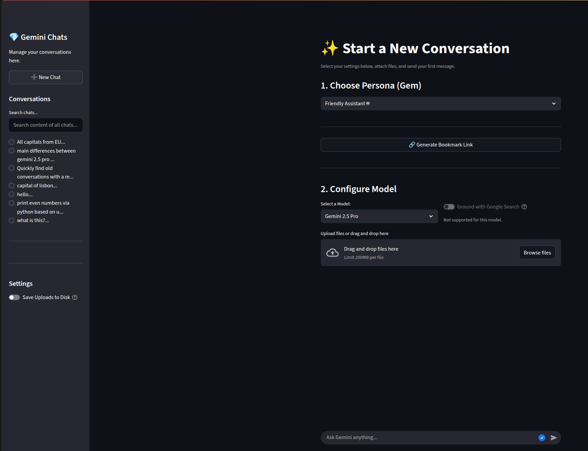

# Gemini Chat UI 💎

**Gemini Gems UI is a powerful, self-hosted web interface for Google's Gemini models, built to enhance the capabilities of the official Google AI Studio.**

The core idea is to bring a critical missing feature to the Gemini workflow: Gems. Gems are reusable, file-based personas or system prompts that allow you to instantly switch the model's behavior, turning it into a specialized tool for any task—from a code helper to a creative writer.

This application provides a persistent, multi-conversation workspace where you can manage your chat history, search past conversations, and interact with the latest Gemini models (including 2.5 Pro) using multimodal inputs like file uploads. It's designed for easy local deployment with Docker, giving you a private and powerful alternative to the standard web UI.



## ✨ Features

- **Expanded Model Selection**: Natively supports `Gemini 2.5 Pro`, `Gemini 2.5 Flash`, `Gemini 1.5 Pro`, and `Gemini 1.5 Flash`. Easily add any other models your API key has access to (including preview models).
- **Persistent Conversations**: Your entire chat history is automatically saved and can be reloaded.
- **Smart Google Search Grounding**: The option to ground responses with Google Search is automatically disabled for models that don't support it, preventing errors.
- **Multimodal Capabilities**: Upload files (images, PDFs, text, etc.) to have the model analyze them as part of your prompt.
- **Customizable "Gems"**: Define different personas in simple JSON files in the `./gems` folder.
- **Local Data Storage**: All conversations (`./data`), file uploads (`./uploads`), and gems (`./gems`) are stored locally.
- **Searchable History**: Quickly find old conversations with a real-time search bar.
- **Bookmarkable Links**: Generate shareable network URLs that directly open a new chat with a specific Gem pre-selected.
- **Network Accessible**: Run the app and access it from any device on your local network.
- **Dockerized Deployment**: Packaged with Docker and Docker Compose for easy, one-command setup.

## 📂 Project Structure

```
gemini-chat-app/
├── .env
├── .env.example
├── app.py
├── requirements.txt
├── check_google_api_models_available.py  #<-- Utility to find your models
├── data/
├── gems/
│   ├── default.json
│   └── ...
├── uploads/
├── Dockerfile
├── docker-compose.yml
└── .dockerignore
```

## 🚀 Getting Started

### Prerequisites

- [Docker](https://docs.docker.com/get-docker/) and [Docker Compose](https://docs.docker.com/compose/install/) installed on your machine.
- A Google AI API Key. You can get one for free from [Google AI Studio](https://aistudio.google.com/app/apikey). Your key may have access to preview models.

### 1. Clone the Repository & Configure API Key

```bash
git clone https://github.com/renantmagalhaes/gemini-studio-frontend.git
cd gemini-studio-frontend

# Copy the example .env file
cp .env.example .env
```

Now, open the newly created `.env` file and paste your API key.

### 2. Build and Run with Docker Compose

This is the recommended way to run the application. From the project's root directory, run:

```bash
docker-compose up --build
```

- `--build`: This flag builds the Docker image. You only need it the first time or if you change `requirements.txt` or the `Dockerfile`.
- The first run will take a few minutes. Subsequent runs are much faster.

Once it's running, you can access the application in your web browser.

- **Local URL**: `http://localhost:8501`
- **Network URL**: `http://<YOUR_MACHINE_IP>:8501` (e.g., `http://192.168.1.10:8501`)

To stop the application, press `Ctrl+C` in the terminal. To run it in the background, use `docker-compose up -d`. To stop a backgrounded app, use `docker-compose down`.

## 🔧 Customizing Available Models (Advanced)

Your API key might have access to more models than the default ones listed, especially preview or experimental models. Here’s how to discover and add them to your app.

### Step 1: Discover Your Models

Run the provided utility script. This script connects to the Google API and lists every single model you have permission to use.

```bash
# Make sure your .env file is configured first!
python3 check_google_api_models_available.py
```

You will see an output like this:

```
--- Discovering Available Models for Your API Key ---
This list shows every model you have permission to use via the API.

Display Name: Gemini 2.5 Pro
  API ID (Model Name): models/gemini-2.5-pro

Display Name: Gemini 1.5 Pro Latest
  API ID (Model Name): models/gemini-1.5-pro-latest

...and so on...
```

Find the model you want to add and copy its **`API ID (Model Name)`**.

### Step 2: Add the Model to `app.py`

Open the `app.py` file and find the `AVAILABLE_MODELS` dictionary. Add a new entry with a friendly name for the UI and the API ID you just copied.

```python
# app.py

AVAILABLE_MODELS = {
    # The new state-of-the-art model available to you
    "Gemini 2.5 Pro": "models/gemini-2.5-pro",

    # ... other models ...

    # Add your newly discovered model here:
    "My Preview Model": "models/gemini-2.5-pro-preview-06-05",
}
```

### Step 3: Update Grounding Support (Important!)

Many preview models do not support Google Search grounding. To prevent errors, you must tell the app to disable the grounding toggle for this new model.

Find the `GROUNDING_UNSUPPORTED_MODELS` list in `app.py` and add the new model's API ID to it.

```python
# app.py

GROUNDING_UNSUPPORTED_MODELS = [
    "models/gemini-2.5-pro",
    "models/gemini-2.5-flash",
    # Add your new model's ID here if it doesn't support grounding
    "models/gemini-2.5-pro-preview-06-05",
]
```

### Step 4: Rebuild the Docker Image

To apply your changes to `app.py`, you must rebuild the image.

```bash
docker-compose up --build
```

Your app's model dropdown will now include the new option, with the grounding toggle correctly enabled or disabled!
